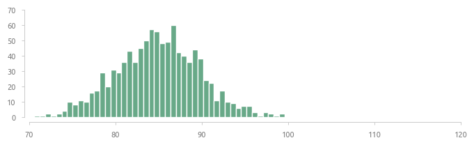
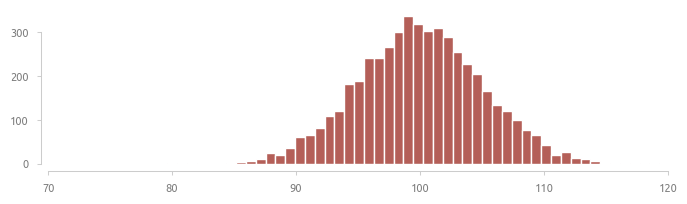
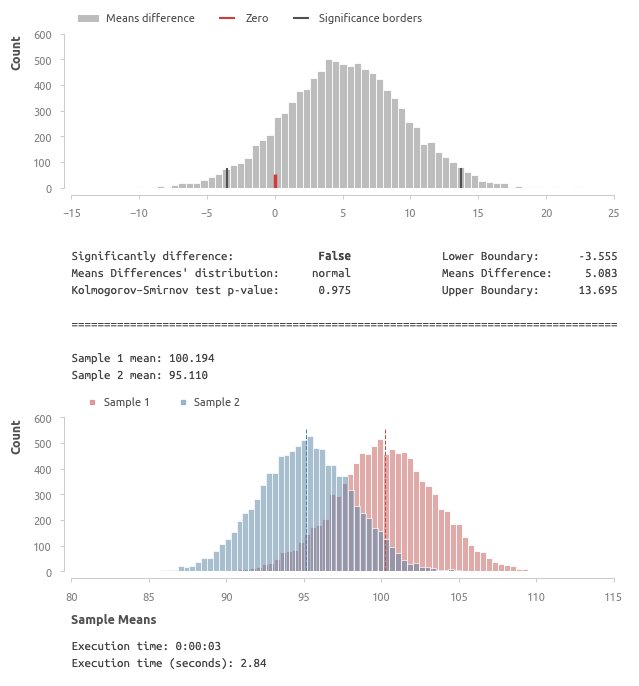
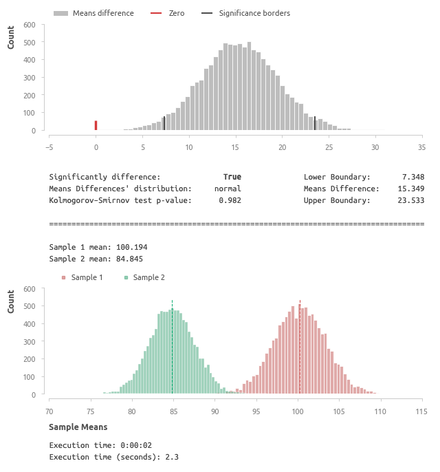
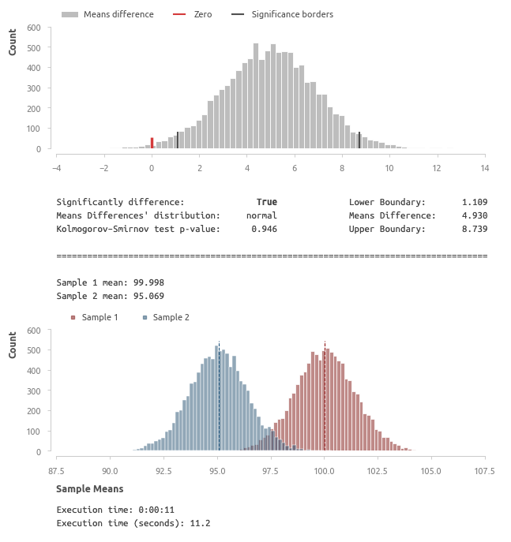

## Пуассоновский бутстрэп 
Cравнение средних значений двух выборок (уровень значимости - 0.05).

### Средние выборки

##### Выборка A (среднее 100, стд. отклонение 5, число элементов 1000)

##### Выборка B (среднее 95, стд. отклонение 5, число элементов 1000)

1000 элементов недостаточно для того, чтобы выявить различия в межгрупповых средних, равное 5% от среднего значения выборки А.  

Верхний график - разность средних значений, на котором хорошо заметно отличие среднего от нуля, и ноль находится вне порогов значиости. 
Распределение средних имеет нормальную форму на уровне значимости 0.05 (p-value: 0.959).

На нижнем графике отображаются распредления средних значений выборок, полученных при сэмплировании.

Теперь сравним выборку А с выборкой, у которой среднее значение равно 85.

##### Выборка A (среднее 100, стд. отклонение 5, число элементов 1000)

##### Выборка C (среднее 85, стд. отклонение 5, число элементов 1000)

Теперь тест зафиксировал значимые различия. 

### Большие выборки

Уведичим число элементов.

##### Выборка D (среднее 100, стд. отклонение 5, число элементов 5000)

##### Выборка E (среднее 95, стд. отклонение 5, число элементов 5000)

После увеличения числа элементов с 1000 до 5000 тест фиксирует значимые различия средних. 

